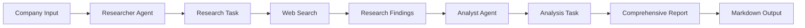

# AI Financial Research Platform - Intelligent Company Analysis

An advanced multi-agent AI research system powered by [crewAI](https://crewai.com) that conducts comprehensive financial research and generates detailed company analysis reports. The platform employs specialized AI agents to gather information, analyze data, and produce professional financial research reports.

## 🎯 Overview

AI Financial Research Platform is an intelligent research system that automates the process of company analysis. It uses multiple AI agents working in sequence to research companies, gather relevant information, and create comprehensive financial reports with insights, trends, and market outlook.

## ✨ Features

- **Comprehensive Research**: Deep-dive research on companies covering current status, historical performance, challenges, and opportunities
- **Multi-Agent Architecture**: Specialized AI agents (Researcher and Analyst) working collaboratively
- **Web Search Integration**: Real-time web search capabilities using SerperDevTool for up-to-date information
- **Professional Reports**: Well-structured, professional reports with executive summaries and detailed analysis
- **Structured Output**: Markdown-formatted reports with clear sections and headings
- **Automated Workflow**: Sequential process ensuring thorough research before analysis
- **Configurable Agents**: Easy customization of agent roles, goals, and research focus

## 🏗️ Architecture

The system uses a sequential process where agents collaborate to produce comprehensive research reports:



## 🤖 Agents

### Researcher Agent
- **Role**: Senior Financial Researcher
- **Responsibilities**: 
  - Research company status and health
  - Analyze historical performance
  - Identify challenges and opportunities
  - Gather recent news and events
  - Research future outlook
- **Tools**: SerperDevTool for web search
- **Model**: GPT-4o-mini
- **Output**: Comprehensive research document with structured findings

### Analyst Agent
- **Role**: Market Analyst and Report Writer
- **Responsibilities**:
  - Analyze research findings
  - Identify patterns and trends
  - Create executive summary
  - Provide market outlook
  - Format professional report
- **Model**: GPT-4o-mini
- **Output**: Polished, professional financial report

## 📋 Prerequisites

- Python >=3.10 <3.13
- [UV](https://docs.astral.sh/uv/) package manager
- OpenAI API key (for Researcher and Analyst agents)
- Serper API key (optional, for enhanced web search)

## 🔧 Installation

1. **Install UV** (if not already installed)
   ```bash
   pip install uv
   ```

2. **Clone the repository**
   ```bash
   git clone https://github.com/mustafasamy28/ai-financial-research-platform.git
   cd ai-financial-research-platform
   ```

3. **Install dependencies**
   ```bash
   crewai install
   ```
   Or using UV directly:
   ```bash
   uv sync
   ```

4. **Set up environment variables**
   Create a `.env` file in the root directory:
   ```env
   OPENAI_API_KEY=your_openai_api_key_here
   SERPER_API_KEY=your_serper_api_key_here  # Optional but recommended
   ```

   Get your Serper API key at: [serper.dev](https://serper.dev)

## 🚀 Usage

### Running a Research Report

To start researching a company:

```bash
crewai run
```

Or using Python directly:

```bash
python -m financial_researcher.main
```

### Customizing the Company

Edit `src/financial_researcher/main.py` to change the target company:

```python
inputs = {
    'company': 'Your Company Name Here'
}
```

### Example Companies

- Apple
- Microsoft
- Tesla
- Amazon
- Google
- Any publicly traded company

## 📊 Report Structure

The generated report includes:

1. **Executive Summary**: High-level overview of findings
2. **Current Company Status**: Current health and performance
3. **Historical Performance**: Past trends and metrics
4. **Challenges and Opportunities**: Key issues and potential
5. **Recent News and Events**: Latest developments
6. **Future Outlook**: Market predictions and trends
7. **Conclusion**: Summary and key takeaways

## 📁 Project Structure

```
.
├── src/
│   └── financial_researcher/
│       ├── __init__.py
│       ├── main.py              # Entry point
│       ├── crew.py               # Crew definition
│       ├── config/
│       │   ├── agents.yaml       # Agent configurations
│       │   └── tasks.yaml        # Task definitions
│       └── tools/
│           ├── __init__.py
│           └── custom_tool.py    # Custom tools
├── output/                       # Generated reports
│   └── report.md                # Final research report
├── knowledge/                    # Knowledge base
├── pyproject.toml               # Project configuration
└── README.md                    # This file
```

## ⚙️ Configuration

### Agents Configuration

Modify `src/financial_researcher/config/agents.yaml` to customize agent roles, goals, and research focus:

```yaml
researcher:
  role: Senior Financial Researcher
  goal: Research the company, news and potential
  backstory: Seasoned financial researcher with talent for finding relevant information
  llm: openai/gpt-4o-mini

analyst:
  role: Market Analyst and Report writer
  goal: Analyze company and create comprehensive, well-structured report
  backstory: Meticulous analyst with background in financial analysis
  llm: openai/gpt-4o-mini
```

### Tasks Configuration

Modify `src/financial_researcher/config/tasks.yaml` to customize research scope and report structure.

## 🔍 Use Cases

- **Investment Research**: Comprehensive company analysis for investment decisions
- **Market Intelligence**: Stay informed about companies and industries
- **Due Diligence**: Research companies before partnerships or acquisitions
- **Competitive Analysis**: Understand competitors and market positioning
- **Educational**: Learn about companies and financial analysis
- **Report Generation**: Automate financial research report creation

## 🛠️ Technology Stack

- **crewAI**: Multi-agent orchestration framework
- **OpenAI API**: GPT-4o-mini for research and analysis
- **SerperDevTool**: Web search capabilities for real-time information
- **Python**: Core programming language
- **UV**: Fast Python package manager
- **YAML**: Configuration management
- **Markdown**: Report formatting

## 📈 Research Areas

The platform researches:

- Current company status and health
- Historical company performance
- Major challenges and opportunities
- Recent news and events
- Future outlook and potential developments
- Market trends and patterns
- Financial metrics and indicators

## ⚠️ Important Notes

- **Not for Trading Decisions**: Reports include market outlook but should not be used as the sole basis for trading decisions
- **Information Accuracy**: While the system uses reliable sources, always verify critical information
- **Research Limitations**: Reports are based on publicly available information
- **API Costs**: Web search and AI model usage may incur API costs

## 🎓 Learning Resources

- [crewAI Documentation](https://docs.crewai.com)
- [crewAI GitHub Repository](https://github.com/joaomdmoura/crewai)
- [Join crewAI Discord](https://discord.com/invite/X4JWnZnxPb)
- [Serper API Documentation](https://serper.dev)

## 🤝 Contributing

Contributions are welcome! Please feel free to submit a Pull Request. For major changes, please open an issue first to discuss what you would like to change.

## 📝 License

This project is open source and available under the MIT License.

## 👤 Author

**Mostafa Samy**

- LinkedIn: [mostafa-samy](https://www.linkedin.com/in/mostafa-samy-9b95711a7/)
- Portfolio: [mostafa-samy.vercel.app](https://mostafa-samy.vercel.app/)

## 🙏 Acknowledgments

- Built with [crewAI](https://crewai.com) - An amazing framework for multi-agent AI systems
- Powered by OpenAI API
- Web search powered by [Serper](https://serper.dev)

## 📊 Example Output

The system generates comprehensive reports saved to `output/report.md` with:

- Executive summary
- Detailed company analysis
- Historical performance review
- Current challenges and opportunities
- Recent news and developments
- Market outlook and predictions
- Professional formatting with clear sections

---

**Note**: This project demonstrates advanced financial research automation using multi-agent AI systems. It showcases expertise in AI agent orchestration, financial analysis, web research, and automated report generation.

